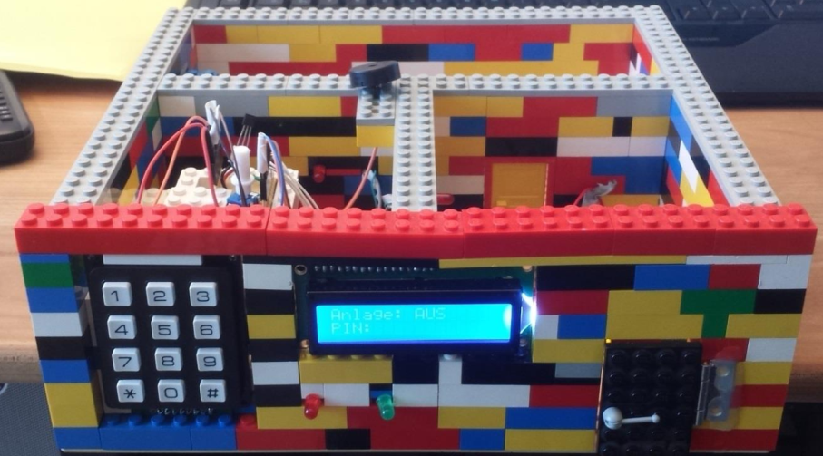
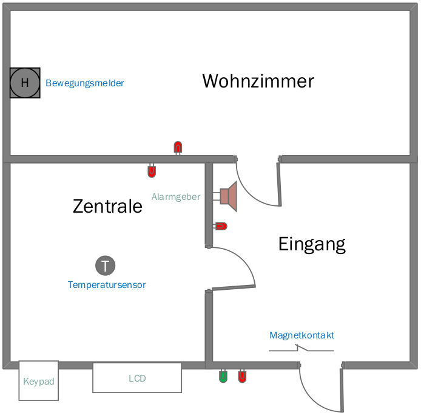

# Term paper Alarm System

This was a term paper in my studies to become an electrical engineer HF in 2015.

It was a fun project in which I used an Arduino to add an alarm system to a Lego house.

Here you can see the result

and here the layout

You can find the Arduino code in this [sketch file](sketch_alarm_system_v1.0.0.ino)
